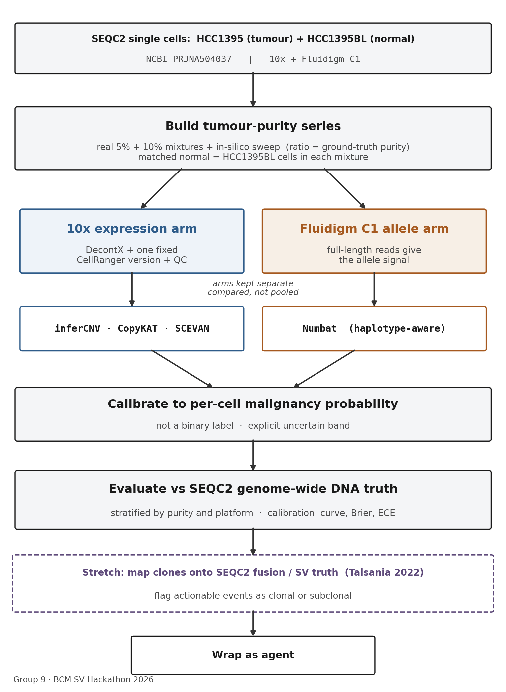

# Group 9 — malignant-cell calling on the SEQC2 breast-cancer reference

BCM Structural Variant Hackathon 2026. Lead: Ilaha Huseynli.

## What we're doing

On the FDA SEQC2 HCC1395 (breast cancer)/HCC1395BL (matched normal) reference, we build a tumour-purity series from the real 5% and 10% cell mixtures plus an in-silico sweep, and benchmark how well single-cell CNV callers tell cancer cells from normal ones as purity drops. We return a calibrated per-cell malignancy probability, not a binary label, and score everything against the known DNA truth.

## Two arms (kept separate — pooling platforms lets batch effects dominate)

- 10x expression arm: inferCNV, CopyKAT, SCEVAN. DecontX + one fixed CellRanger version.
- Fluidigm C1 allele arm: Numbat (full-length reads give the allele signal it needs).
- Matched normal reference = the HCC1395BL cells in each mixture.

## Evaluation

Malignant-cell calling and clone structure vs the SEQC2 genome-wide DNA truth, stratified by purity and platform. Per-cell calibration (calibration curve, Brier, ECE). Stretch: map clones onto the SEQC2 fusion/SV truth, flag actionable events as clonal or subclonal.

## Data

- Single cells (mixtures, 4 platforms): NCBI PRJNA504037
- DNA truth: SEQC2 (SRP162370 + high-confidence VCFs); SV/fusion truth: Talsania 2022
- Reference genome: GRCh38
- Reuse comparison metrics: github.com/xchen004/CNV_inference_benchmark

## Team

## Team

- Ilaha Huseynli (lead) — method, clinical framing
- Arijita Sarkar (arijita88) — single-cell analysis: data loading, QC, building the mixtures, running callers
- Fangfei Guo (PhoebeGuo97) — benchmarking: scoring callers vs DNA truth
- Kate Newcomer (k8newcomer) — per-cell malignancy probability method
- Phuc Nguyen (Mustardburger) — fusion stretch: linking clones to actionable gene fusions
- Mahrukh Saddiquee (mahrukhsaddiqui8-creator) — write-up and figures
