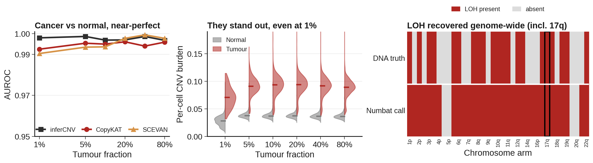
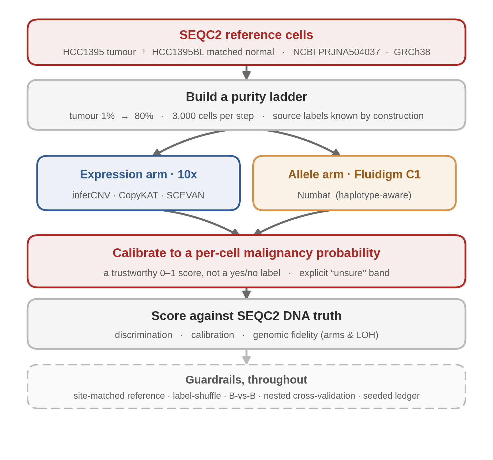
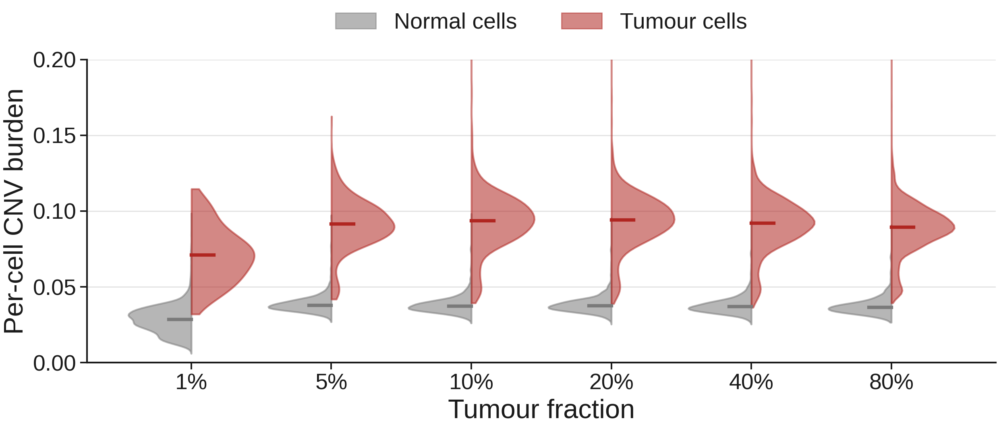
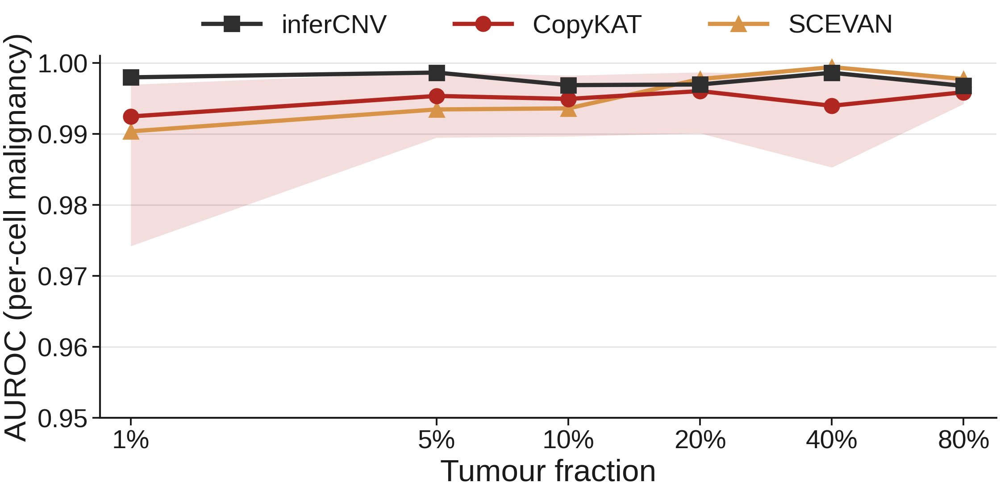
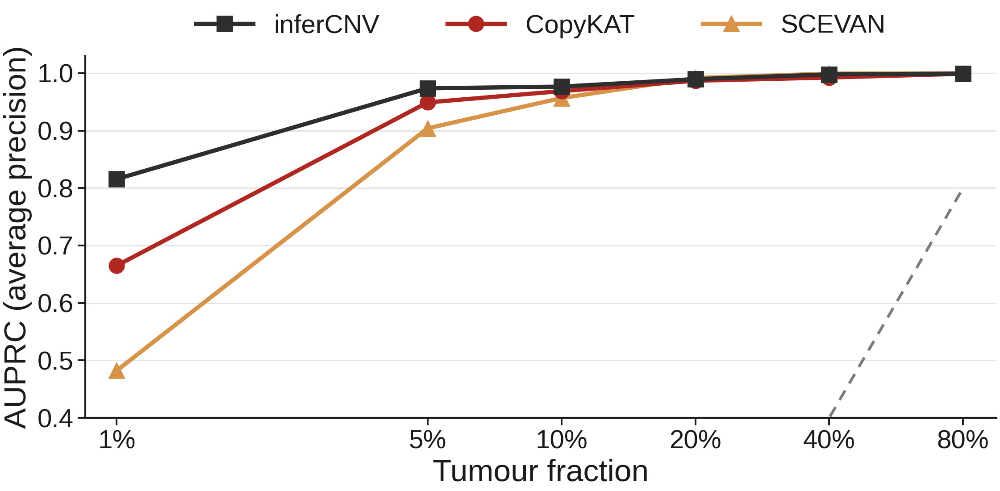
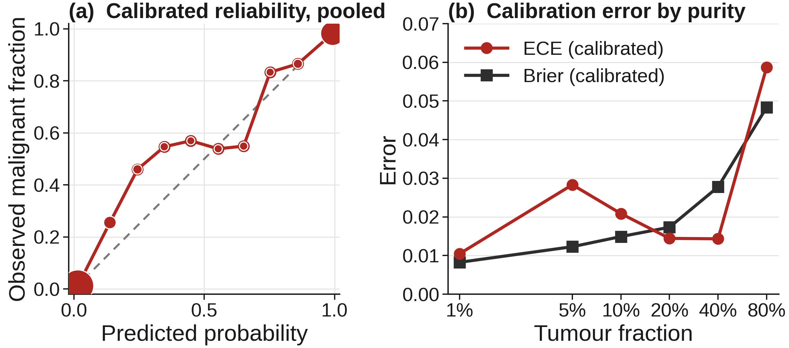
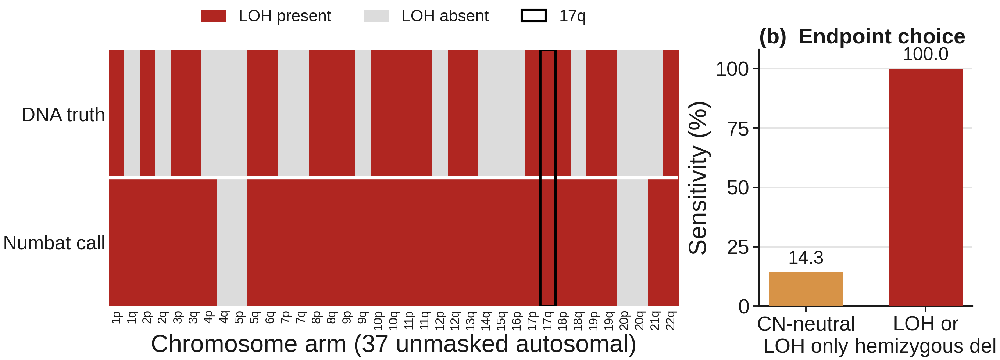
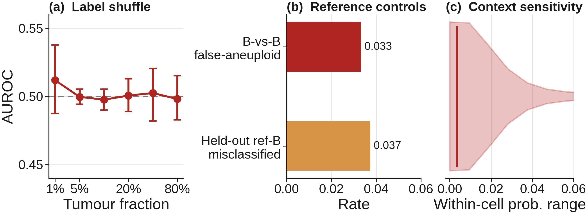
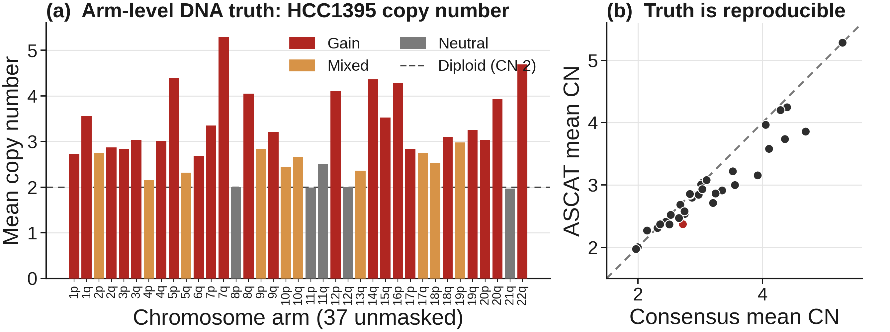
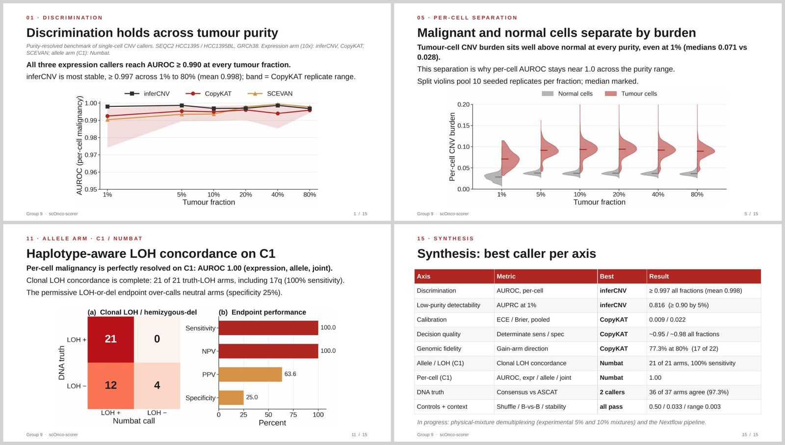

<div align="center">

<h1>scOnco-scorer</h1>

<p><strong>How faint can a cancer signal get before we lose it? A purity-resolved benchmark of single-cell cancer-cell detection on an FDA reference..</strong></p>

<p>
  <a href="#what-we-found"></a>
  <a href="slides/Results_Group_9.pdf"></a>
  <a href="METHODS.md"></a>
  <a href="https://www.ncbi.nlm.nih.gov/bioproject/PRJNA504037"></a>
  
  
  
  <a href="https://fritzsedlazeck.github.io/blog/2026/hackathon-2026/"></a>
  <a href="LICENSE"></a>
</p>

<p>Give three tumour-detection tools the same cells, dial the amount of cancer from most to almost none, and measure the point where each one starts to fail, how honestly it reports its own confidence, and whether it recovers the real genomic scars of the tumour.</p>



</div>


> [!IMPORTANT]
> The results below come from the **in-silico purity series**, where every cell's true identity is known by construction, scored against the **SEQC2 DNA truth**. Two things are deliberately kept apart: the **10x** and **Fluidigm C1** arms use different cells and are never merged, and per-cell **calibration** is judged against known cell identity while **genomic fidelity** is judged against the DNA copy-number truth. Assigning identity in the **real 5% and 10% physical mixtures**, and packaging the pipeline in Nextflow, are in progress.

<details>
<summary><strong>Contents</strong></summary>

- [Overview](#overview)
- [What the benchmark answers](#what-the-benchmark-answers)
- [How it fits together](#how-it-fits-together)
- [What we found](#what-we-found)
- [Results at a glance](#results-at-a-glance)
- [Why you can trust these numbers](#why-you-can-trust-these-numbers)
- [The slide deck](#the-slide-deck)
- [Reproduce it](#reproduce-it)
- [Data, truth, and reading](#data-truth-and-reading)
- [Team](#team)
</details>
---

## Overview

A tumour sample is a crowd. Most of what you sequence is normal tissue; the cancer cells hide among them, and in a real biopsy they can be a small minority. If a tool is going to call a single cell malignant, two questions matter more than anything: **does it still work when cancer cells are rare**, and **does it know when it is unsure**.

We took an FDA benchmarking pair of cell lines, a triple-negative breast cancer line and its matched normal from the same person, and built a **purity ladder**: mixtures running from 80% tumour all the way down to 1% tumour. At each rung we asked three widely used expression tools (inferCNV, CopyKAT, SCEVAN) and one allele-aware tool (Numbat) to score every cell, then checked their answers against the tumour's known DNA. Instead of a yes/no label, every cell gets a **calibrated probability of being malignant**, with an explicit "unsure" band, so a downstream user knows how much to trust each call.

The short answer: the tools separate cancer from normal almost perfectly by ranking, even at 1% tumour; where they differ is in **how usable that ranking is at a fixed threshold**, **how well-calibrated their confidence is**, and **how faithfully they recover the tumour's real chromosome changes**.

---

## What the benchmark answers

| Ask | Measure | Interpret | Reproduce |
|---|---|---|---|
| Can it find cancer cells as they get rare? | Ranking quality across the purity ladder (AUROC, AUPRC) | A detectability floor: the lowest tumour fraction each tool survives | Seeded mixtures, ledgered inputs, versioned tools |
| Can I trust the probability it reports? | Calibration curve, Brier score, expected calibration error | Whether a "0.9" really means 90% | Nested, cell-grouped cross-validation |
| Does it recover the real tumour genome? | Chromosome-arm direction and loss-of-heterozygosity against DNA truth | Genomic fidelity, not just a class label | Orthogonal DNA truth, masked normal-abnormal regions |
| Is the result an artefact? | Negative controls and cohort-composition stress tests | A pass/fail gate before any claim | Label-shuffle, B-vs-B, reference-split checks |

---

## How it fits together

<div align="center">

</div>

| Stage | In plain terms | What comes out |
|---|---|---|
| **Purity ladder** | Mix known tumour and normal cells at set ratios, 1% to 80% | A controlled series where the right answer is known |
| **Expression arm (10x)** | Read each cell's genome-wide expression for copy-number shadows | A continuous malignancy score per cell, three tools |
| **Allele arm (Fluidigm C1)** | Use phased alleles, the signal full-length reads give | An independent, allele-aware malignancy and clone call |
| **Calibration** | Turn each raw score into an honest 0 to 1 probability | A trustworthy probability with an "unsure" band |
| **Scoring** | Compare to SEQC2 DNA truth by purity and platform | Discrimination, calibration, and genomic-fidelity numbers |
| **Guardrails** | Controls that run throughout, not at the end | A benchmark that fails loudly when something is wrong |

Full methods, settings, and provenance live in **[METHODS.md](METHODS.md)**.

---

## What we found

### Cancer cells stand out, even at 1%

Malignant cells carry a broad copy-number burden that normal cells do not, and that burden separates the two populations at every rung of the ladder. This separation is the reason ranking stays near-perfect down to 1% tumour.

<div align="center">

</div>

### Ranking is near-perfect; the useful floor is at 1%

By ranking (AUROC), all three expression tools clear 0.99 at every purity, and inferCNV is the steadiest, holding at 0.997 or better from 1% to 80%. The real stress test is precision at very low purity: at 1% tumour, inferCNV holds an average precision of **0.816**, CopyKAT **0.665**, and SCEVAN **0.482**, and all three recover to 0.90 or better by 5%.

<div align="center">


</div>

### A "0.9" really means 90%

A score is only useful if its confidence is honest. After calibration, CopyKAT's probabilities track the ideal line closely, with a pooled expected calibration error of **0.009** and a Brier score of **0.022**. The calibrator is chosen by nested, cell-grouped cross-validation, so the same cell never trains and tests the model.

<div align="center">

</div>

### The tumour's real chromosome changes are recovered

Beyond labelling cells, the tools recover the tumour's actual genome. On the direction of chromosome-arm gains, CopyKAT is strongest, recovering **77% of gain arms (17 of 22)** at 80% purity, with inferCNV steady near 68%. On the allele arm, Numbat recovers **every one of the 21 loss-of-heterozygosity arms in the DNA truth, including the known 17q event**, at 100% sensitivity.

<div align="center">

</div>

### Every negative control behaves

None of the above is an artefact. Shuffle the labels and discrimination collapses to chance (AUROC near 0.50). Score held-out normal cells against a normal reference and the false-cancer rate is **3.3%**. Re-expose the same cell to different surrounding mixtures and its probability barely moves (median within-cell range **0.003**).

<div align="center">

</div>

---

## Results at a glance

| Axis | Best tool | Result |
|---|---|---|
| Discrimination (ranking) | inferCNV | AUROC ≥ 0.997 at every purity (mean 0.998) |
| Low-purity detectability | inferCNV | Average precision 0.816 at 1%; ≥ 0.90 by 5% |
| Calibration | CopyKAT | Expected calibration error 0.009, Brier 0.022 |
| Decision quality | CopyKAT | Determinate sensitivity ~0.95, specificity ~0.98, all purities |
| Genomic fidelity (gain arms) | CopyKAT | 77% direction recovered at 80% (17 of 22) |
| Loss-of-heterozygosity (allele arm) | Numbat | 21 of 21 truth arms, 100% sensitivity, includes 17q |
| Per-cell allele evidence | Numbat | AUROC 1.00 (expression, allele, joint) |
| DNA truth itself | two callers | Consensus and ASCAT agree on 36 of 37 arms |
| Negative controls | all pass | Shuffle 0.50; false-cancer 0.033; context range 0.003 |

---

## Why you can trust these numbers

Good benchmarks fail loudly. These guardrails run throughout, and a claim is only reported once they pass.

- **The reference never leaks a batch effect.** Each mixture is scored against a normal reference from the same sequencing site, so a site effect cannot masquerade as a copy-number signal.
- **The same cell never trains and tests a calibrator.** Whole cells are grouped into outer folds; calibration is fit only on training cells.
- **Uncertainty respects the design.** Because a cell can recur across mixtures, intervals come from source-cell cluster bootstrap, not naive row resampling; every headline number carries a 95% interval.
- **The normal is not assumed perfect.** Regions where the matched-normal line is itself abnormal (6p, 16q, X) are masked out of tumour-versus-normal scoring rather than counted as errors.
- **Everything is seeded and ledgered.** Inputs, checksums, tool versions, and seeds are recorded so a run reproduces from scratch.

<div align="center">

</div>

---

## The slide deck

A fifteen-slide results deck walks through discrimination, calibration, genomic fidelity, the allele arm, and the controls.

<div align="center">
<a href="slides/Results_Group_9.pdf"></a>
<p><a href="slides/Results_Group_9.pdf"><strong>Open the deck (PDF)</strong></a> · <a href="slides/Results_Group_9.pptx">PowerPoint</a></p>
</div>

---

## Reproduce it

The analysis is a set of R scripts over deposited single-cell data; results and figures regenerate from the tables in this repository.

```bash
# 1. tumour-vs-normal callers on each purity rung (10x expression arm)
Rscript scripts/run_infercnv_corrected.R
Rscript scripts/adapter_copykat.R
Rscript scripts/run_scevan_corrected.R

# 2. allele arm (Fluidigm C1 / Numbat)
Rscript scripts/c1_run_numbat_runlevel_pure.R

# 3. calibrate raw scores into per-cell probabilities
Rscript calibration/16_apply_calibration_to_expression_scores.R

# 4. score against SEQC2 DNA truth and draw the figures
Rscript scripts/scoring_metrics.R
Rscript scripts/make_purity_performance_figure.R
```

Precomputed benchmark tables are under [`results/`](results/); the numbers in this README.

---

## Data, truth, and reading

| Resource | Link |
|---|---|
| Single cells (mixtures, multiple platforms) | NCBI BioProject **PRJNA504037** |
| DNA copy-number truth | Masood *et al.*, *Genome Biology* (2024) · [doi:10.1186/s13059-024-03294-8](https://doi.org/10.1186/s13059-024-03294-8) |
| Structural-variant / fusion truth | Talsania *et al.*, *Genome Biology* (2022) · [doi:10.1186/s13059-022-02816-6](https://doi.org/10.1186/s13059-022-02816-6) |
| SEQC2 mutation reference call sets | Fang *et al.*, *Nature Biotechnology* (2021) · [doi:10.1038/s41587-021-00993-6](https://doi.org/10.1038/s41587-021-00993-6) |
| Allele-aware single-cell CNV (Numbat) | Gao *et al.*, *Nature Biotechnology* (2023) · [doi:10.1038/s41587-022-01468-y](https://doi.org/10.1038/s41587-022-01468-y) |
| Reference genome | GRCh38 |
| Comparison-metric conventions | [github.com/xchen004/CNV_inference_benchmark](https://github.com/xchen004/CNV_inference_benchmark) |
| Full methods and provenance | [METHODS.md](METHODS.md) |

---

## Team

| Member | Focus |
| :--- | :--- |
| **Ilaha Huseynli** · Lead | Method, clinical framing, data and compute setup, Write-up, figures, and slides |
| Arijita Sarkar | Single-cell analysis: loading, QC, mixture construction, running callers, Write-up and figures |
| Fangfei Guo | Benchmarking: scoring callers against DNA truth, Write-up and figures |
| Kate Newcomer | Per-cell malignancy probability and calibration, Write-up and figures |
| Phuc Nguyen | Fusion stretch: linking clones to actionable gene fusions, Write-up and figures |
| Mahrukh Saddiquee | Write-up |

---

## Acknowledgements

Built at the **BCM Structural Variant Hackathon 2026**, hosted by Baylor College of Medicine, 25 to 28 August 2026. We thank the organizers, mentors, and collaborators for the environment and support that made this work possible.

We acknowledge the SEQC2 and FDA teams for the HCC1395/HCC1395BL reference and its DNA truth, and the authors of inferCNV, CopyKAT, SCEVAN, and Numbat for the tools this benchmark evaluates. Naming a resource identifies its provenance and does not imply endorsement of this prototype's results. Derived outputs here are research artifacts with explicit methods and limitations, not clinical evidence.

---

## License

Released under the [MIT License](LICENSE). Please cite the SEQC2 reference and the tool papers above when using this benchmark.

<div align="center">
<sub><strong>scOnco-scorer</strong> · Group 9 · reproducible by construction, calibrated by cell identity, validated against orthogonal DNA truth</sub>
</div>
